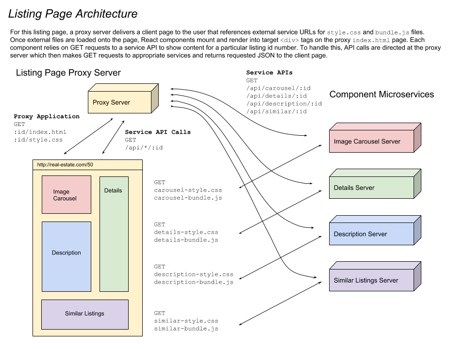
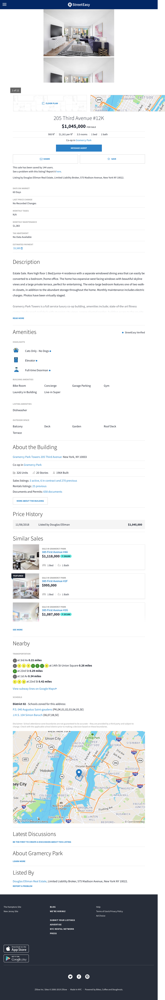
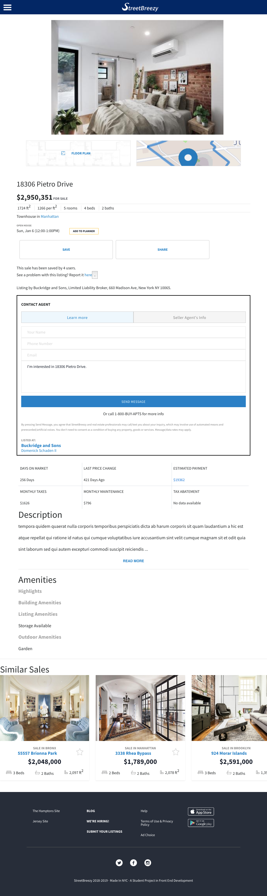
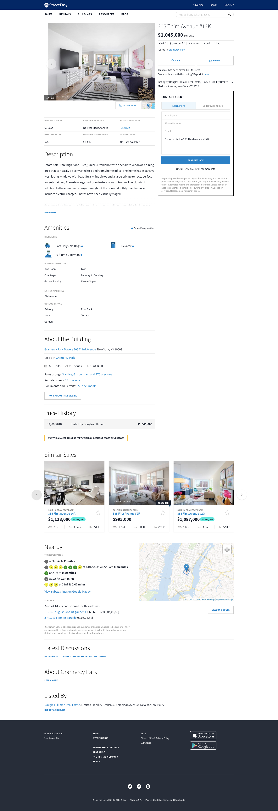
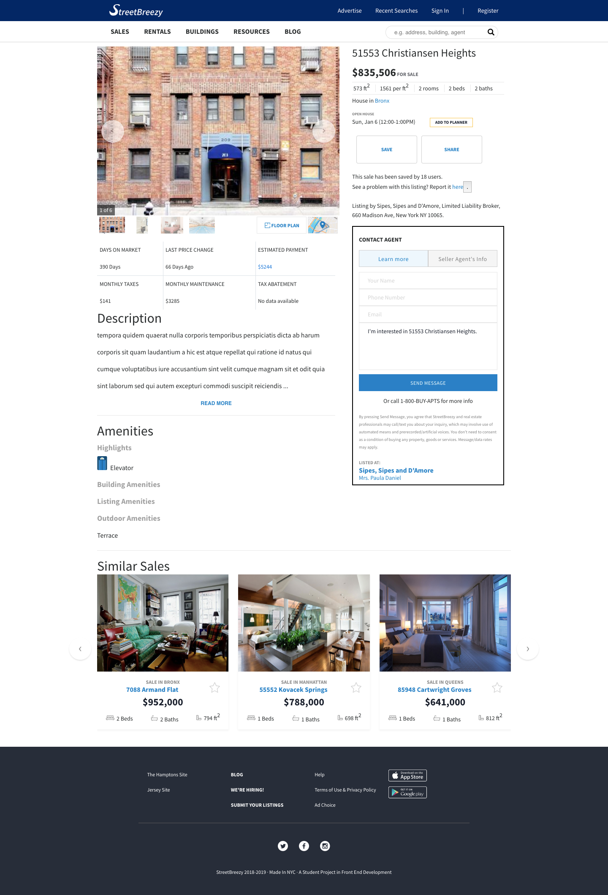

# real-estate-listing-page
> Real estate listing page based on a client side microservice architecture


This project contains the source for a single listing page inspired by the New York City real estate website StreetEasy.com

In this project, a team of four developers contributed components which make up the full page. Each component works on its own as a complete fullstack application and this project combines each component into a complete listing page in the style of a service oriented or microservice architecture.

## Readme Contents

- [Project Architecture](#project-architecture)
- [Development and Deployment](#development-and-deployment)
- [Visual Comparison](#visual-comparison)
- [Authors](#authors)
- [Acknowledgments](#acknowledgments)
- [References](#references)

## Related Repositories

- Contributed Component
  - [Image Carousel Component](https://github.com/Team-Elysium/image-carousel-component)

- Colleagues' Components
  - [Listing Details Component](https://github.com/Team-Elysium/listing-details)
  - [Listing Description Component](https://github.com/Team-Elysium/Description-Amenities-About_the_Building)
  - [Similiar Listings Component](https://github.com/Team-Elysium/Similar-Listings-Recommendations)

## Key Dependencies

- Components written with the [React](https://reactjs.org) front end framework
- [Node.js](https://nodejs.org/en/) with [Express.js](https://expressjs.com/) web framework
- [EJS](https://ejs.co/) Templating
- [Eric Meyer's CSS Reset](https://meyerweb.com/eric/tools/css/reset/)
- ESLint for maintaining [AirBnB JS styleguide](https://github.com/airbnb/javascript)

## Project Architecture

This project's architecture was designed to reach a minimum viable product within the quick timeframe for development. Getting the services working together required coordinating to choose appropriate target div ids for each React component to render into on the `index.html` page, coordination over API endpoint names and coordination to ensure stylesheets were loaded in the correct order and coordination to avoid css selector collisions.

Alternative approaches could be taken and might help improve page performance:

- One option would be to route all traffic through the proxy server. In this case, the proxy server could periodically check for changes to the services' `style.css` and `bundle.js` files and cache them. With these files stored on the proxy server they could be combined and minified so that the client has to make less GET requests.
- Alternately, each component could be modified so that they send API GET requests directly back to their own servers instead of routing through the proxy server. This would eliminate the potential bottleneck of a proxy server.

With a number of variables at play in these three architecture options, AB testing would help reveal the pros and cons of each design.



## Development and Deployment

### Installing Dependencies

From within the root directory:

```
npm install
```

### Connnecting to Services

The file `service_urls.example.json` contains a template for entering URLS relative to each service. Use it to create a new file `service_urls.json` at the top level of the project repo. 

In production, each microservice would likely run on it's own machine or container, but for development, each service may be run on a different port on the same server instance wich `service_urls.json` directing the client application to make requests to different ports on the same machine.

### Running the Server

To run the Express.js server in development mode run the command:

```bash
npm run start-dev
```

### Deploying

For deploying this listing application, create a Unix server instance (**Ubuntu Server 18.04 LTS** is recommended).

Run the following commands:

```bash
# Install Node and npm
sudo apt-get update
sudo apt-get install node npm 

# Clone the project repo
git clone https://github.com/Team-Elysium/real-estate-listing-page

# Navigate into the repo directory
cd real-estate-listing-page

# Install Forever process manager
sudo npm install forever -g

# Make rc.local file executable and copy into /etc/
sudo chmod +x deployment/rc.local && sudo cp deployment/rc.local /etc

# Create and edit service_urls.json
# You may need to install and run services on the same machine
cp service_urls.example.json service_urls.json
nano service_urls.json

# Run rc.local to start the server
# rc.local will also run whenever the machine boots
sudo /etc/rc.local
```

## Visual Comparison

As a front end development project, one key goal was to replicate the appearance of a popular web application

<div>
  <span style="float: left; width: 40%">
    <h3>
			Reference Mobile View   
    </h3>
      
  </span>
  <span style="float: left; width: 40%">
    <h3>
			Project Mobile View
    </h3>
      
  </span>
</div>
<hr style="border: none; height: 0px; border-bottom: 1px solid #eaecef;">
<div>
  <span style="float: left; width: 40%">
    <h3>
			Reference Desktop View      
    </h3>
      
  </span>
  <span style="float: left; width: 40%">
    <h3>
			Project Desktop View   
    </h3>
      
  </span>
</div>	

## Authors

- **Jared Ellison** - [jaredellison.net](http://jaredellison.net)

## Acknowledgments

- **Project Team** - *Each contributed components to listing page*
  - [Sujin Lee](https://github.com/slee1016) - Details Component
  - [Austin Joo](https://github.com/AustinJoo) - Description Component
  - [Muhammad Mosaad](https://github.com/moemosaad) - Similar Listings Component

- **Technical Mentors** - *Provided instruction and guidance on JS fundamentals and project architecture*
  - [Joseph Martin](https://github.com/jpranaymartin)
  - [Trent Going](https://github.com/trentgoing)

## References

- [A great talk](https://www.youtube.com/watch?v=5yK3lx-PQV0) by [Laurie Voss](https://github.com/seldo) from [npm](https://www.npmjs.com/) about their use of microservices
